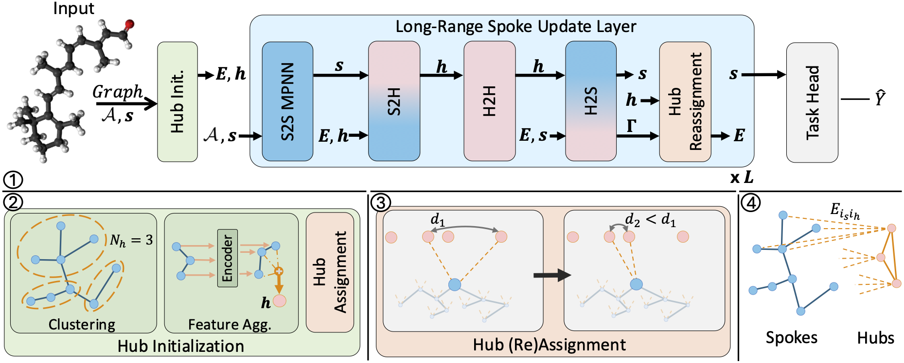

# ReHub: Linear Complexity Graph Transformers with Adaptive Hub-Spoke Reassignment

[](https://arxiv.org/abs/TODO)





### Python environment setup with Conda

```bash
conda create -n rehub python=3.10
conda activate rehub

conda install pytorch==2.4.0 torchvision==0.19.0 torchaudio==2.4.0 pytorch-cuda=12.4 -c pytorch -c nvidia
pip install torch_geometric
pip install pyg_lib torch_scatter torch_sparse torch_cluster torch_spline_conv -f https://data.pyg.org/whl/torch-2.4.0+cu124.html
conda install lightning -c conda-forge
pip install pymetis yacs torchmetrics wandb ogb pandas einops performer-pytorch
conda install openbabel fsspec rdkit -c conda-forge

conda clean --all
```


### Running ReHub
```bash
conda activate rehub

# Running ReHub for LRGB Datasets
python main.py --cfg configs/ReHub/peptides-func-ReHub.yaml wandb.use False
python main.py --cfg configs/ReHub/peptides-struct-ReHub.yaml wandb.use False
python main.py --cfg configs/ReHub/pcqm-contact-ReHub.yaml wandb.use False

# Running ReHub for OGBN-Arxiv
python main.py --cfg configs/Rehubs/ogbn-arxiv-ReHub.yaml wandb.use False
```


### Guide on configs files

The config files structure are the same as in GraphGPS. For Rehub you can change the following config parameters:
```
rehub:
  prep: True         # Set True to enable preprocessing of partitioning the graph
                     # into clusters.
  hubs_per_spoke: 3  # Set the number of hubs each spoke would connect to.
  num_hubs_type: 'D' # Options are 'D' for dynamically ajusting the number of hubs
                     # according the graph size, or 'S' for a static amount of hubs 
                     # for all graphs.
  num_hubs: 1.0      # For num_hubs_type='D' this value is the Hub Ratio, meaning 
                     # that for each graph there would be num_hubs*sqrt(#Spokes) hubs.
                     # For num_hubs_type='S' this value is the number of hubs.
  spokes_mlp_before_hub_agg: True # Adds an MLP for the spokes features before they
                     # are aggregated to the hub features
  reassignment_strategy: 'k_closest_by_attention' # For the reassignment strategy
                     # introduced in the paper choose 'k_closest_by_attention'.
                     # To disable reassignment replace with None.
```

## Code Guide

The most substanial part of the model can be found in:
- `graphgps/network/rehub_model.py` where hubs are initialized in the `HubCreator` class.
- `graphgps/layer/rehub_layer.py` where the `ReHub` class holds the global part of "Long-Range Spoke Update Layer". i.e. from "Spokes to Hubs" to "Hub (Re)Assignment".
- `graphgps/transform/spoke_hub_clusters.py` which clusters each graph according to the number of hubs.

We also provide code for the "Large Random Regular Graphs" custom dataset at `graphgps/loader/dataset/large_random_graph.py`.

Additional util files are available on:
- `graphgps/layer/rehub_utils.py` for hub reassignment and metrics.
- `graphgps/train/metric_utils.py` for metrics.


## Citation

Our work can be cited using the following bibtex:
```bibtex
TODO
```